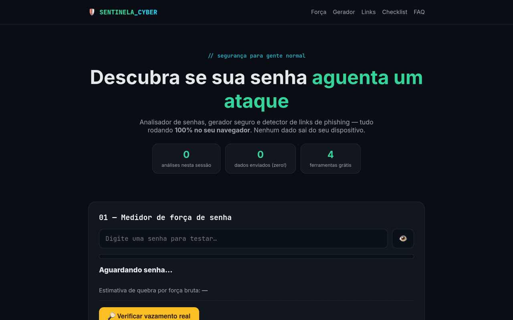
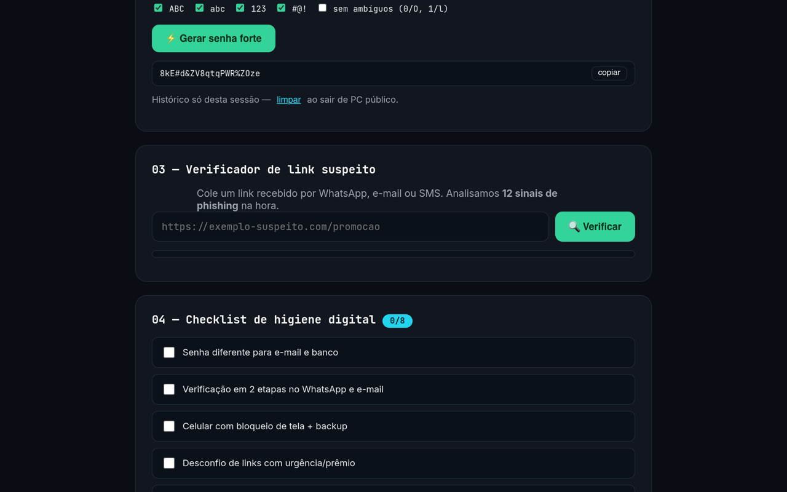
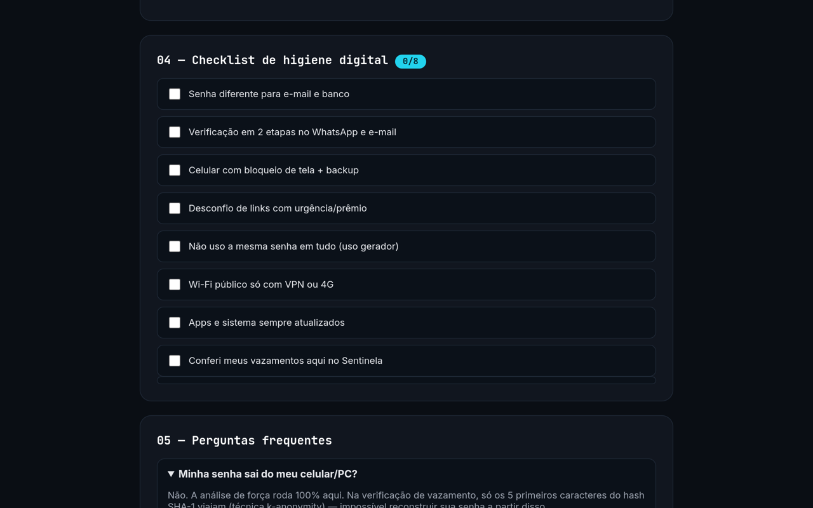

# 🛡️ LAUDO Nº 001 — SENTINELA CYBER

**Classificação:** PÚBLICO · **Analista:** Wagner Schemmer · **Veredito:** ✅ SEGURO PARA USO

> Objeto periciado: kit de higiene digital 100% client-side.
> Conclusão: nenhum dado do usuário sai do dispositivo em nenhum dos 5 testes.

[](https://sentinela-cyber.vercel.app)

<a href="https://sentinela-cyber.vercel.app"></a>

## Testes executados

| # | Teste | Amostra | Resultado |
|---|---|---|---|
| 01 | Medidor de força | `Tr4balho&2026!` → 78 bits, ~3 mil anos p/ quebrar | ✅ SEGURO |
| 02 | Vazamento real | SHA-1 parcial (k-anonymity, 5 chars viajam) | ✅ SEGURO |
| 03 | Gerador | `crypto.getRandomValues`, 8–64 chars / frase PT-BR | ✅ SEGURO |
| 04 | Links | `banc0-segur0.com` → score 12/100, 9 heurísticas | ✅ PHISHING |
| 05 | Checklist | 8 itens de higiene, salvos em `localStorage` | ✅ SEGURO |

## Anexos fotográficos

**Exhibit A — Gerador em operação:**
<a href="https://sentinela-cyber.vercel.app"></a>

**Exhibit B — Verificador de links + checklist:**
<a href="https://sentinela-cyber.vercel.app"></a>

## Cadeia de custódia (seus dados)

```
senha digitada ──▶ RAM do navegador ──▶ ████ (não sai)
link colado   ──▶ 9 heurísticas locais ──▶ nota 0–100
5 chars SHA-1 ──▶ haveibeenpwned.com ──▶ "vazou / não vazou"
```

Nada mais atravessa a fronteira. Sem conta, sem servidor, sem rastro.

## Reproduzir a perícia

```bash
git clone https://github.com/Wagner-Schemmer/sentinela-cyber.git
cd sentinela-cyber && python3 -m http.server
# → http://localhost:8000
```

Arquivos do caso: `index.html` (a cena) · `script.js` (o laudo) · `styles.css` (o escuro) · `manifest.json` (PWA p/ levar no bolso).

## Ficha do instrumento

<div align="center">
  
</div>

JavaScript puro, zero dependências, zero build. PWA instalável, funciona offline.

## Arquivo (star history)

<a href="https://www.star-history.com/#Wagner-Schemmer/sentinela-cyber&Date"></a>

## Assinatura

Perito: [Wagner Schemmer](https://wagner-port.vercel.app) · [Portfólio](https://wagner-port.vercel.app) [Wagner Schemmer](https://wagner-port.vercel.app) · [Portfólio](https://wagner-port.vercel.app)
